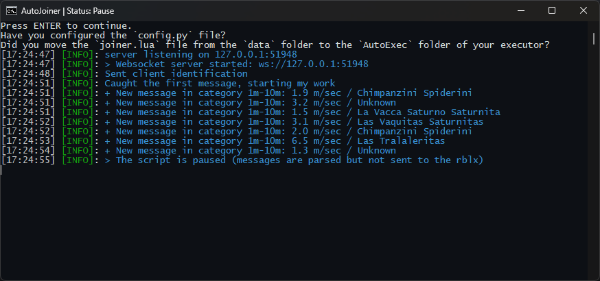

# Roblox AutoJoiner for Chilli Notify's (Steal a Brainrot)

A script for automatically connecting to servers in Roblox, from logs in Chilli Hub (Steal A Brainrot game). Allows you to filter by the amount of “earnings per second” on Brainrot and automatically connect to the server.

## ⚙️ Capabilities
- Earnings filtering - does not connect to servers if brainrot's earnings per second are below the specified threshold.

- Discord integration - uses a Discord token to listen to notifications from Chilli Notify via WebSocket.

- Fully automated launch with Lua script.

## 📥 Installation
1. Install Python 3.12 or higher:
https://www.python.org/downloads/

2. Download or clone the repository.

3. Run setup.bat - it will automatically install all dependencies.

4. Wait for the installation to complete and configure the config.py file:

- Specify the value of MONEY_THRESHOLD (in millions, example: 1.3).

- Insert your DISCORD_TOKEN:
https://www.youtube.com/results?search_query=how+to+get+discord+token

5. Go to the data/ folder, find the joiner.lua file, and copy it to the AutoExec folder of your executor.

6. Run start.bat.

7. Controls:

- F2 - pause/resume the script.

## ⭐ Project support

- If you found this script useful, please give it a star ⭐ on the repository. This motivates me to develop it further and create new projects.