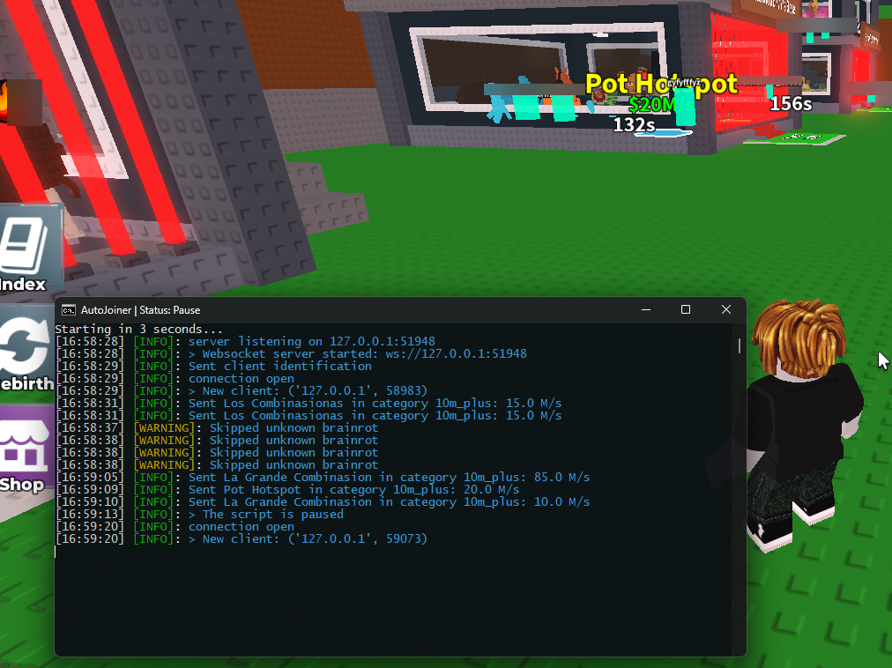

# 🧠 Roblox AutoJoiner for Chilli Notify's (Steal a Brainrot)

Софт для автоматического подключения к серверам в Roblox из логов в Chilli Hub (плейс Steal A Brainrot). Позволяет фильтровать по количеству "заработка в секунду" у брейнрота, по кол-ву игроков на сервере, позволяет игнорировать "неизвестных" брейнротов и автоматически подключаеться к серверу.

Software for automatic connection to servers in Roblox from logs in Chilli Hub (Steal A Brainrot place). Allows you to filter by the amount of "earnings per second" at the brainrot, by the number of players on the server, allows you to ignore "unknown" brainrots and automatically connect to the server.

## ⚙️ Возможности
- Фильтрация доходов - не подключается к серверам, если доход брейнрота в секунду ниже чем указано в кфг.
- Фильтрация по кол-ву игроков - не подключается к серверам, у которых кол-во игроков больше чем указано в кфг.
- использует токен Discord для прослушивания сообщений от Chilli Notify через WebSocket.
- Полностью автоматический запуск с помощью скрипта Lua.
- Байпасит вход на сервера с 10м+ брейнротами.
- Игнорирует "Unknown" брейнротов если такая опция включена в кфг.
- Возможность входить только по заданным брейнротам
- Возможность скипа заданных брейнротов

## 📥 Установка
1. Установите Python 3.12 или выше (с галочкой добавить в path): [клик](https://www.python.org/downloads/release/python-3120/)
2. Загрузите или клонируйте репозиторий.
3. Запустите `setup.bat` - он автоматически установит все библиотеки.
4. Дождитесь завершения установки и настройте файл config.py (открой его через блокнот):
5. Перейдите в папку `data`, найдите файл `joiner.lua` и скопируйте его в папку `AutoExec` вашего екзекьютора.
6. Запустите `start.bat`.
7. F2 - приостановить/возобновить работу скрипта.

## ⚙️ Features
- Income filtering - does not connect to servers if the brainrot income per second is lower than specified in the kfg.
- Filtering by number of players - does not connect to servers with more players than specified in the kfg.
- Uses a Discord token to listen to messages from Chilli Notify via WebSocket.
- Fully automatic launch using a Lua script.
- Bypasses login to servers with 10m+ brainrates.
- Ignores “Unknown” brainrates if this option is enabled in the kfg.
- Ability to log in only with specified brainrates
- Ability to skip specified brainrates

## 📥 Installation
1. Install Python 3.12 or higher (with a tick add to path): [click](https://www.python.org/downloads/release/python-3120/)
2. Download or clone the repository.
3. Run `setup.bat` - it will automatically install all libraries.
4. Wait for the installation to complete and configure the config.py file (open it with notepad):
5. Go to the `data` folder, find the `joiner.lua` file and copy it to the `AutoExec` folder of your executor.
6. Run `start.bat`.
7. F2 - pause/resume the script.

## ⭐ Project support / Поддержка проекта
- If you found this script useful, please give it a star ⭐ on the repository. This motivates me to develop it further and create new projects.
- Если этот скрипт оказался вам полезным, пожалуйста, поставьте мне звездочку ⭐ в репозитории. Это мотивирует меня на его дальнейшее развитие и создание новых проектов.
- FREE FOREVER / БЕСПЛАТНО НАВСЕГДА
- Discord: https://discord.gg/fQSP3VFks9